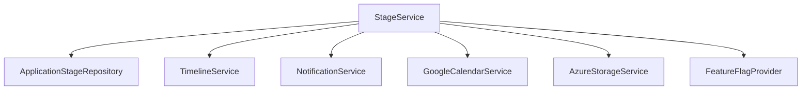

# 2. Enhancement Scope & Integration Strategy

## Scope Summary

Epic 5 delivers a polymorphic stage system, lifecycle orchestration service, migration tooling, UI timeline refactor, and enriched offer/onboarding flows. All other roadmap capabilities (templates, AI insights, automation, collaboration) are explicitly deferred.

## In-Scope

- Stage data model & migration (Story 5.1)
- StageService + repository layer (Story 5.2)
- Timeline UI refactor & action surfaces (Story 5.3)
- Assignment, live interview, offer & offer accepted stage behavior (Stories 5.4–5.6)
- Onboarding docs & disqualification logic (Stories 5.7–5.8)
- Stage management UI (Story 5.9)
- Mobile optimization, security audit, deployment documentation (Stories 5.10–5.12)

## Out-of-Scope

- Workflow templates, automation rules, AI predictions, collaboration threads, multi-approver flows.

## Integration Principles

1. Non-invasive layering: new model added in parallel—legacy status retained temporarily.
2. Progressive enablement via feature flag `FEATURE_DYNAMIC_STAGES`.
3. Stable IDs & order fields allow deterministic diffing & reordering.
4. Cross-service boundaries minimized: StageService delegates to existing services rather than embedding their logic.

## Service Interaction Map

## Data Flow Examples

### Live Interview Scheduling

1. Recruiter calls `scheduleInterview` tRPC.
2. StageService validates multiplicity & ordering.
3. Creates live_interview stage (status: pending).
4. Invokes GoogleCalendarService → event + scheduledCall record.
5. Updates stage `data.scheduledCallId`, sets status `awaiting_candidate` or `in_progress` if directly booked.
6. Emits timeline event + notification.

### Assignment Submission

1. Candidate uploads file → Azure pre-signed URL handled by existing storage service.
2. `uploadAssignmentAnswer` mutation validates stage state.
3. StageService updates submission metadata & sets status `awaiting_recruiter`.
4. Notification to recruiter; timeline event logged.

## Migration Approach

| Phase        | Action                                 | Safeguards                          |
| ------------ | -------------------------------------- | ----------------------------------- |
| Dry Run      | Compute staged transformations only    | Output diff counts, no writes       |
| Execute      | Write `stages[]`, `currentStageId`     | Wrap in retry + backup checkpoint   |
| Validation   | Scan for invariant violations          | Abort flag triggers rollback script |
| Rollout      | Enable feature flag (10% → 50% → 100%) | Metrics & error thresholds          |
| Decommission | Remove legacy status usage             | Only after stability window         |

## Rollback Strategy

- Maintain shadow write of legacy `status` during transition window.
- Retain original timeline events to reconstruct prior state.
- Idempotent migration function keyed by application `_id` + version stamp.

## KPIs Monitored During Rollout

| KPI                            | Target | Alert Threshold |
| ------------------------------ | ------ | --------------- |
| Stage transition latency (p95) | <250ms | >500ms          |
| Failed stage writes            | 0%     | >0.2%           |
| Data integrity violations      | 0      | >0              |
| Timeline load time (10 stages) | <3s    | >4s             |

## Defer / Revisit List

Items intentionally deferred get tracked in `12-next-steps.md` to preserve architectural context and prevent accidental scope creep.
