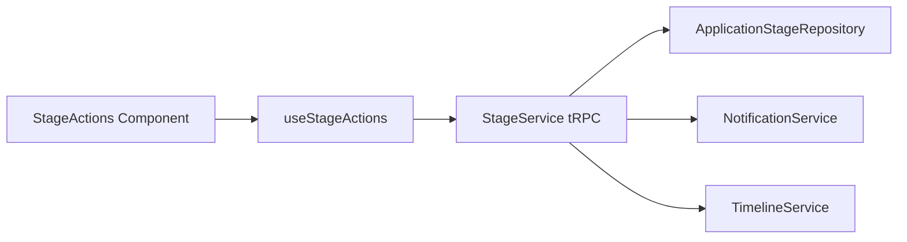

# 4. Component Architecture

## Frontend Component Layers

| Layer           | Purpose                                   | Examples                                        |
| --------------- | ----------------------------------------- | ----------------------------------------------- |
| Pages / Routes  | Entry composition & data prefetch         | `/app/application/[id]` timeline view           |
| Containers      | Orchestrate hooks, loading & error states | `ApplicationTimeline`                           |
| Presentational  | Stateless visual blocks                   | `TimelineStage`, `StageProgress`                |
| Action Surfaces | Buttons / modals encapsulating mutations  | `GiveAssignmentModal`, `SendOfferModal`         |
| Hooks           | Data & action resolution                  | `useStages`, `useStageActions`, `useAssignment` |
| Utils           | Pure helpers & formatting                 | `stageStatusLabel()`, `computeProgress()`       |

## Component Tree (Simplified)

```
<ApplicationTimeline>
  <TimelineHeader />
  <StageList>
    <TimelineStage * n>
      <StageIcon />
      <StageHeader />
      <StageContent />
      <StageActions />
      <StageFooter />
    </TimelineStage>
  </StageList>
  <TimelineFooter />
</ApplicationTimeline>
```

## State Management Strategy

- Primary data fetch via tRPC + React Query caching (staleTime ≈ 60s for stages list; mutations invalidate specific keys: `['application', id, 'stages']`).
- Local optimistic updates for non-complex transitions (status updates) with rollback on error.
- Avoid global stores—stage data locality reduces incidental coupling.

## Action Resolution Flow



## Rendering Optimizations

- Virtualization not required MVP (<15 items) but design allows plug-in of `react-virtual` if stage counts increase.
- Memoize heavy stage sub-blocks (assignment feedback display) behind status gating.
- Framer Motion variants centralized in `utils/animationVariants.ts`.

## Mobile Adaptations

| Concern         | Desktop                           | Mobile                                    |
| --------------- | --------------------------------- | ----------------------------------------- |
| Layout          | Horizontal scroll-snap (optional) | Vertical stacked stages                   |
| Actions         | Inline buttons                    | Bottom sheet action group                 |
| Stage Expansion | Accordions optional               | Accordions default collapsed past current |

## Accessibility Considerations

- Keyboard navigable stage list (arrow key traversal).
- ARIA roles: `list` / `listitem` for stages; `status` region updates for live changes.
- High contrast status badges & focus outlines.

## Error & Empty States

| Scenario                  | Handling                               |
| ------------------------- | -------------------------------------- |
| No stages (pre-migration) | Fallback message + retry & report link |
| Network failure           | Toast + retry mutation route           |
| Unauthorized action       | Disabled button + tooltip reason       |
| Disqualified              | Banner + read-only collapsed stages    |

## Reuse from Epic 4

| Existing Component   | Reuse Mode                          | Notes                                |
| -------------------- | ----------------------------------- | ------------------------------------ |
| `CallScheduler`      | Wrapped in `ScheduleInterviewModal` | Provide application & stage context  |
| Timeline event item  | Pattern reference                   | Migrate iconography & spacing tokens |
| Notification banners | Direct                              | Provide consistent feedback UI       |

## Theming & Styling

- Continue Tailwind + design tokens from Epic 4 style guide.
- Introduce semantic classes: `stage-current`, `stage-completed`, `stage-actionable`.

## Performance Budgets

| Metric                                                    | Target  |
| --------------------------------------------------------- | ------- |
| First render (cold)                                       | <1200ms |
| Stage status mutation roundtrip                           | <400ms  |
| Assignment upload UX latency (pre-signed URL acquisition) | <800ms  |
