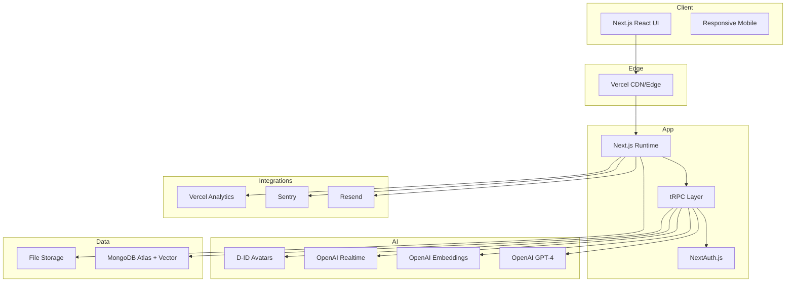

# TeamMatch Fullstack Architecture Document

> Version: 1.0 • Date: 2025-10-27

---

## Introduction

This document outlines the complete fullstack architecture for **TeamMatch AI-Powered Job Application System**, including backend systems, frontend implementation, and their integration. It serves as the single source of truth for AI-driven development, ensuring consistency across the entire technology stack.

This unified approach combines what would traditionally be separate backend and frontend architecture documents, streamlining the development process for modern fullstack applications where these concerns are increasingly intertwined.

### Starter Template or Existing Project

Decision: Use a **T3-inspired greenfield implementation** (Next.js + TypeScript + tRPC + NextAuth.js) adapted for **MongoDB Atlas Vector Search** and advanced AI integrations (OpenAI + D-ID). Template generators (T3, create-next-app) are referenced but implementation is handcrafted for flexibility.

Rationale: The platform’s AI-first requirements (semantic matching, real-time interviews, avatar synthesis) require tight control over integration layers, performance, and cost optimization beyond what a stock starter provides.

---

## High Level Architecture

### Technical Summary

TeamMatch implements a modern **T3 Stack architecture** enhanced with AI vector search, real-time interview streaming, and multi-role access control. A monolithic Next.js application deployed to Vercel provides SSR/ISR, edge delivery, and API execution. MongoDB Atlas delivers document + vector storage; OpenAI and D-ID power resume intelligence, embeddings, and avatar-driven interviews.

### Platform & Infrastructure Choice

**Chosen Stack:** Vercel (Next.js hosting + Edge) + MongoDB Atlas + OpenAI + D-ID + Resend + Sentry + Vercel Analytics.

Alternatives considered: AWS (higher complexity, overkill early), Railway (less optimized Next.js ecosystem). Vercel chosen for speed, developer ergonomics, global edge performance, and tight Next.js integration.

### Repository Structure (Summary)

Monorepo using npm workspaces dividing concerns into `apps` (web), `packages` (shared types, services, data-access, AI clients, monitoring, config), and `infrastructure` (CI/CD, scripts). Designed for future extraction of high-traffic domains (interview, matching) if needed.

### Architecture Diagram (Mermaid)

### Architectural Patterns

- End-to-end type safety (tRPC + TypeScript)
- Vector-first matching (MongoDB Atlas Vector Search)
- Service modularization (AI, matching, interview orchestration)
- Event-triggered side effects (notifications, analytics)
- Real-time WebSocket (tRPC subscriptions for interviews)

---

## Tech Stack (Summary)

| Category    | Technology                           | Version    | Rationale                                 |
| ----------- | ------------------------------------ | ---------- | ----------------------------------------- |
| Frontend    | Next.js + TypeScript                 | 14+ / 5.3+ | SSR, App Router, type safety              |
| UI          | Material-UI                          | 5.14+      | Accessible, themeable enterprise UI       |
| State       | TanStack Query                       | 4.36+      | Server state caching, request dedupe      |
| Backend API | tRPC                                 | 10.45+     | Type-safe RPC, no manual REST boilerplate |
| Auth        | NextAuth.js                          | 4.24+      | Multi-provider, session mgmt              |
| DB          | MongoDB Atlas                        | 7.0+       | Document + Vector Search unified          |
| AI          | OpenAI GPT-4 / Embeddings / Realtime | Latest     | Resume intelligence & interviews          |
| Avatar      | D-ID API                             | Latest     | Professional interview experience         |
| Email       | Resend                               | Latest     | Transactional messaging                   |
| Monitoring  | Sentry + Vercel Analytics            | Latest     | Error & performance observability         |
| Logging     | Pino                                 | 8.x        | Structured, high-perf JSON logs           |

---

## Data Models (Highlights)

Core entities: User, CandidateProfile, Job, Application, InterviewSession.
All searchable semantic entities store an OpenAI embedding vector (`semanticVector: number[]`). Application scoring persists multi-factor breakdown and interview boost.

---

## API Specification (tRPC Routers)

Routers: `auth`, `user`, `candidate`, `job`, `application`, `interview`, `recruiter`, `ai` combined into `appRouter`. All protected procedures enforce role gating via middleware; public browsing limited to job discovery endpoints.

Real-time interview streaming implemented through `interview.liveSession` subscription producing event payloads (question, transcription, scoring deltas, connection health).

---

## Components (Backend Service Layer)

- **AIServiceManager** – OpenAI orchestration, retries, cost tracking.
- **VectorSearchEngine** – MongoDB Vector Search abstraction.
- **ApplicationScoringEngine** – Multi-factor score + transparency.
- **InterviewOrchestrator** – Realtime session lifecycle with avatar sync.
- **UserAuthenticationSystem** – Role-aware auth extensions.
- **FileStorageManager** – Secure resume & recording persistence (local → S3 path).
- **NotificationService** – Email + in-app triggers.
- **AnalyticsCollector** – Event ingestion + recruiter dashboards.

---

## External APIs

OpenAI (chat, embeddings, realtime), D-ID (avatar synthesis), MongoDB Atlas (vector & document), Resend (email), Vercel Analytics (performance), Sentry (error tracking). Circuit breakers + exponential backoff on all critical integrations; avatar and analytics degrade gracefully.

---

## Core Workflows (Summary)

1. **Resume Upload → Extraction → Embedding → Candidate Profile readiness.**
2. **Job Posting → Embedding → Candidate Match Suggestions → Notifications.**
3. **Application Creation → Initial Multi-factor Scoring → Dashboard Visibility.**
4. **AI Interview Scheduling → Real-time Session → Scoring & Boost → Application Update.**

Each workflow isolates expensive AI operations asynchronously with progress feedback and robust fallback modes.

---

## Database Schema (MongoDB)

Collections: `users`, `candidateProfiles`, `jobs`, `applications`, `interviewSessions`.
Vector indexes: `candidate_vector_search`, `job_vector_search` (cosine similarity, 1536 dimensions). Text indexes for hybrid search. Status histories embedded for auditability.

---

## Frontend Architecture

App Router groups by role domain; TanStack Query for server state; minimal Zustand store for transient real-time interview state; strong separation between `features` and reusable `components/ui` primitives; strict environment access via a config adapter.

---

## Backend Architecture

Serverless Next.js execution with layered pattern: Routers → Services → Repositories → External. Native MongoDB driver for fine-grained control. Decoupled services for AI, matching, interview orchestration supporting future extraction.

---

## Unified Project Structure

Monorepo with `apps/web` and modular `packages` (shared types, ai-services, data-access, services, monitoring, config). Enables evolutionary scaling and selective extraction into independent deployables when traffic hotspots emerge.

---

## Development Workflow (See below – interactive refinement in progress)

---

## (Sections Pending Completion)

- Development Workflow
- Deployment Architecture
- Security & Performance
- Testing Strategy
- Coding Standards (Fullstack Rules)
- Error Handling Strategy
- Monitoring & Observability
- Checklist Results Report

---

_Document will continue evolving interactively; all decisions recorded with rationale for traceability._
