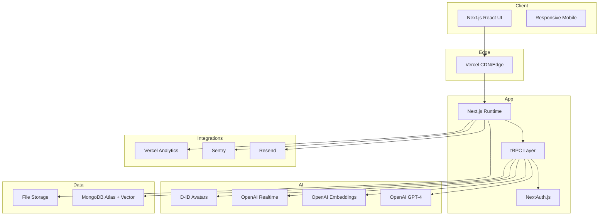

# TeamMatch Fullstack Architecture Document

> Version: 1.0 • Date: 2025-10-27

---

## Introduction

This document outlines the complete fullstack architecture for **TeamMatch AI-Powered Job Application System**, including backend systems, frontend implementation, and their integration. It serves as the single source of truth for AI-driven development, ensuring consistency across the entire technology stack.

This unified approach combines what would traditionally be separate backend and frontend architecture documents, streamlining the development process for modern fullstack applications where these concerns are increasingly intertwined.

### Starter Template or Existing Project

Decision: Use a **T3-inspired greenfield implementation** (Next.js + TypeScript + tRPC + NextAuth.js) adapted for **MongoDB Atlas Vector Search** and advanced AI integrations (OpenAI + D-ID). Template generators (T3, create-next-app) are referenced but implementation is handcrafted for flexibility.

Rationale: The platform’s AI-first requirements (semantic matching, real-time interviews, avatar synthesis) require tight control over integration layers, performance, and cost optimization beyond what a stock starter provides.

---

## High Level Architecture

### Technical Summary

TeamMatch implements a modern **T3 Stack architecture** enhanced with AI vector search, real-time interview streaming, and multi-role access control. A monolithic Next.js application deployed to Vercel provides SSR/ISR, edge delivery, and API execution. MongoDB Atlas delivers document + vector storage; OpenAI and D-ID power resume intelligence, embeddings, and avatar-driven interviews.

### Platform & Infrastructure Choice

**Chosen Stack:** Vercel (Next.js hosting + Edge) + MongoDB Atlas + OpenAI + D-ID + Resend + Sentry + Vercel Analytics.

Alternatives considered: AWS (higher complexity, overkill early), Railway (less optimized Next.js ecosystem). Vercel chosen for speed, developer ergonomics, global edge performance, and tight Next.js integration.

### Repository Structure (Summary)

Monorepo using npm workspaces dividing concerns into `apps` (web), `packages` (shared types, services, data-access, AI clients, monitoring, config), and `infrastructure` (CI/CD, scripts). Designed for future extraction of high-traffic domains (interview, matching) if needed.

### Architecture Diagram (Mermaid)



### Architectural Patterns

- End-to-end type safety (tRPC + TypeScript)
- Vector-first matching (MongoDB Atlas Vector Search)
- Service modularization (AI, matching, interview orchestration)
- Event-triggered side effects (notifications, analytics)
- Real-time WebSocket (tRPC subscriptions for interviews)

---

## Tech Stack (Summary)

| Category    | Technology                           | Version    | Rationale                                 |
| ----------- | ------------------------------------ | ---------- | ----------------------------------------- |
| Frontend    | Next.js + TypeScript                 | 14+ / 5.3+ | SSR, App Router, type safety              |
| UI          | Material-UI                          | 5.14+      | Accessible, themeable enterprise UI       |
| State       | TanStack Query                       | 4.36+      | Server state caching, request dedupe      |
| Backend API | tRPC                                 | 10.45+     | Type-safe RPC, no manual REST boilerplate |
| Auth        | NextAuth.js                          | 4.24+      | Multi-provider, session mgmt              |
| DB          | MongoDB Atlas                        | 7.0+       | Document + Vector Search unified          |
| AI          | OpenAI GPT-4 / Embeddings / Realtime | Latest     | Resume intelligence & interviews          |
| Avatar      | D-ID API                             | Latest     | Professional interview experience         |
| Email       | Resend                               | Latest     | Transactional messaging                   |
| Monitoring  | Sentry + Vercel Analytics            | Latest     | Error & performance observability         |
| Logging     | Pino                                 | 8.x        | Structured, high-perf JSON logs           |

---

## Data Models (Highlights)

Core entities: User, CandidateProfile, Job, Application, InterviewSession.
All searchable semantic entities store an OpenAI embedding vector (`semanticVector: number[]`). Application scoring persists multi-factor breakdown and interview boost.

---

## API Specification (tRPC Routers)

Routers: `auth`, `user`, `candidate`, `job`, `application`, `interview`, `recruiter`, `ai` combined into `appRouter`. All protected procedures enforce role gating via middleware; public browsing limited to job discovery endpoints.

Real-time interview streaming implemented through `interview.liveSession` subscription producing event payloads (question, transcription, scoring deltas, connection health).

---

## Components (Backend Service Layer)

- **AIServiceManager** – OpenAI orchestration, retries, cost tracking.
- **VectorSearchEngine** – MongoDB Vector Search abstraction.
- **ApplicationScoringEngine** – Multi-factor score + transparency.
- **InterviewOrchestrator** – Realtime session lifecycle with avatar sync.
- **UserAuthenticationSystem** – Role-aware auth extensions.
- **FileStorageManager** – Secure resume & recording persistence (local → S3 path).
- **NotificationService** – Email + in-app triggers.
- **AnalyticsCollector** – Event ingestion + recruiter dashboards.

---

## External APIs

OpenAI (chat, embeddings, realtime), D-ID (avatar synthesis), MongoDB Atlas (vector & document), Resend (email), Vercel Analytics (performance), Sentry (error tracking). Circuit breakers + exponential backoff on all critical integrations; avatar and analytics degrade gracefully.

---

## Core Workflows (Summary)

1. **Resume Upload → Extraction → Embedding → Candidate Profile readiness.**
2. **Job Posting → Embedding → Candidate Match Suggestions → Notifications.**
3. **Application Creation → Initial Multi-factor Scoring → Dashboard Visibility.**
4. **AI Interview Scheduling → Real-time Session → Scoring & Boost → Application Update.**

Each workflow isolates expensive AI operations asynchronously with progress feedback and robust fallback modes.

---

## Database Schema (MongoDB)

Collections: `users`, `candidateProfiles`, `jobs`, `applications`, `interviewSessions`.
Vector indexes: `candidate_vector_search`, `job_vector_search` (cosine similarity, 1536 dimensions). Text indexes for hybrid search. Status histories embedded for auditability.

---

## Frontend Architecture

App Router groups by role domain; TanStack Query for server state; minimal Zustand store for transient real-time interview state; strong separation between `features` and reusable `components/ui` primitives; strict environment access via a config adapter.

---

## Backend Architecture

Serverless Next.js execution with layered pattern: Routers → Services → Repositories → External. Native MongoDB driver for fine-grained control. Decoupled services for AI, matching, interview orchestration supporting future extraction.

---

## Unified Project Structure

Monorepo with `apps/web` and modular `packages` (shared types, ai-services, data-access, services, monitoring, config). Enables evolutionary scaling and selective extraction into independent deployables when traffic hotspots emerge.

---

## Development Workflow

This workflow defines how engineers (and AI dev agents) reliably build, test, and ship TeamMatch features with guard rails for quality, cost, and security.

### 1. Local Prerequisites

Install and maintain the following minimum versions:

- Node.js 20.x (LTS) – ensures optimal Vercel + edge compatibility
- npm 10.x (use core, avoid mixing yarn/pnpm initially)
- Docker Desktop (future: optional for local MongoDB; MVP can use Atlas dev cluster)
- MongoDB Atlas Dev Cluster credentials (.env setup)

Optional (recommended):

- `direnv` for environment variable loading
- VSCode extensions: ESLint, Prettier, GitLens, Error Lens

### 2. Environment Variables

All secrets accessed through the config adapter; never directly via `process.env` in feature code.

`/.env.example` (excerpt):

```
OPENAI_API_KEY=
DID_API_KEY=
MONGODB_URI=
NEXTAUTH_SECRET=
NEXTAUTH_URL=http://localhost:3000
RESEND_API_KEY=
VECTOR_DIMENSIONS=1536
MAX_INTERVIEW_DURATION_MINUTES=25
ENABLE_AI_INTERVIEW=true
```

Validation occurs at runtime via `packages/config/src/env.ts` (Zod schema). CI fails if required vars are missing for non-production workflows.

### 3. Initial Setup

Commands (run from repo root):

```bash
npm install                 # Install root + workspace deps
npm run build:types         # Optional: verify shared types compile
npm run dev                 # Starts Next.js + any watch scripts
```

Recommended composite script (to add later): `scripts/dev.sh` to: (1) validate env, (2) start Next.js, (3) tail logs.

### 4. Project Scripts (Proposed)

Root `package.json` scripts (to be implemented):

```
"scripts": {
    "dev": "turbo run dev --parallel",
    "lint": "turbo run lint",
    "typecheck": "turbo run typecheck",
    "test": "turbo run test",
    "test:watch": "turbo run test -- --watch",
    "build": "turbo run build",
    "prepare": "husky install",
    "format": "prettier . --write",
    "e2e": "playwright test",
    "vector:health": "node scripts/check-vector-health.ts",
    "seed": "node scripts/seed-db.ts"
}
```

### 5. Branching & Git Hygiene

- **main**: Always deployable; protected (PR required, CI must pass).
- **dev** (optional): Integration branch if feature velocity is high; merges daily.
- **feature/<jira|story-id>-short-desc**: Individual features.
- **fix/<id>-description**: Bug fixes.
- **chore/<tooling|deps>**: Non-feature code maintenance.

**Commit Message Convention (Conventional Commits)**:
`feat: interview scoring normalization`
`fix: handle resume extraction timeout`
`chore: bump MUI version`
`perf: reduce redundant embedding generation`
`test: add candidate match algorithm edge cases`

### 6. Pull Request Checklist (Minimum)

Before requesting review:

- [ ] Lint & typecheck PASS
- [ ] Unit tests added/updated (critical logic & edge cases)
- [ ] Updated docs (architecture.md / ADR if architectural decision)
- [ ] No direct `process.env` usage in feature code
- [ ] AI cost impact assessed if introducing new OpenAI calls

### 7. Quality Gates

| Gate        | Tooling          | PASS Criteria                                                     |
| ----------- | ---------------- | ----------------------------------------------------------------- |
| Lint        | ESLint           | No errors; warnings < threshold (≤10)                             |
| Types       | tsc (strict)     | Zero errors                                                       |
| Unit Tests  | Jest             | ≥90% critical modules (scoring, interview) coverage; overall ≥70% |
| E2E         | Playwright       | Core journeys (auth, upload, apply, interview start) pass         |
| Performance | Lighthouse (CI)  | PWA not required; LCP < 2.5s on sample dataset                    |
| Security    | Dependency audit | No high severity unresolved                                       |

### 8. Testing Strategy (Execution Order)

1. **Unit Tests**: Pure functions (score weighting, vector similarity, parsing). Fast feedback.
2. **Service Tests**: Interview orchestration, resume extraction fallback paths (mock AI).
3. **Integration Tests**: tRPC routers with in-memory or isolated Atlas test database.
4. **E2E Tests**: Playwright scripts exercising critical flows.
5. **Load/Perf (Later)**: K6 or Artillery simulation around vector queries & interview concurrency.

Sample Jest test category mapping:

```
tests/
    unit/
        scoring-algorithm.test.ts
        vector-similarity.test.ts
    service/
        interview-orchestrator.test.ts
    integration/
        trpc-application-router.test.ts
    e2e/ (delegated to Playwright)
```

### 9. AI Cost Guard Rails

- **Token Budget**: Resume extraction ≤ 25K tokens per resume end-to-end.
- **Vector Generation**: Re-embedding only on significant profile changes (skill set, summary, experience modifications > threshold).
- **Realtime Interviews**: Soft cap 20 minutes (configurable), enforce silence timeout.
- **Circuit Breakers**: If daily OpenAI spend > configured budget, downgrade model (GPT-4 → GPT-4-mini or fallback prompt compression) and alert.

### 10. Performance Budgets

- Page Load (Jobs Listing LCP): < 2500ms (median on simulated 4G)
- API Response (tRPC application score fetch): < 500ms (95th percentile)
- Vector Search (top 50 matches): < 300ms (95th percentile)
- Interview Latency (Realtime audio response): < 500ms round trip

Monitoring dashboards must surface exceptions beyond SLO thresholds for review each sprint.

### 11. Local Data Strategy

- Prefer MongoDB Atlas Dev cluster; use read/write-limited user.
- Seed script creates: sample candidates, jobs (varied skills), applications, vector embeddings.
- Daily pruning script removes expired jobs, orphan interview sessions.

### 12. Background / Async Tasks (Phase 2)

Introduce a lightweight queue (e.g., BullMQ or Cloudflare Queues) for:

- Bulk re-vectorization (nightly job)
- Email digest sending
- Large analytics aggregation

For MVP: Promise-based asynchronous fire-and-forget with retry wrappers and dead-letter logging.

### 13. Code Review Guidelines

Reviewers evaluate:

- **Correctness**: Data integrity, score math, role checks.
- **Safety**: No secret leakage, AI usage constrained, error handling.
- **Maintainability**: Module boundaries intact, coupling minimized.
- **Observability**: Logs & metrics for new complex flows.
- **Regression Risk**: Adequate tests for changed critical paths.

### 14. Developer Tooling Enforcement

- Pre-commit: `lint-staged` (ESLint + Prettier) + typecheck on touched files.
- Pre-push: Jest test subset (changed modules) + lightweight Playwright smoke.
- CI: Full test matrix (unit + integration + e2e), coverage upload, vulnerability scan.

### 15. Security & Compliance Hooks (Workflow Tie-in)

- Secrets never logged.
- PII fields masked in debug logs.
- GDPR erase workflow validated by integration test (delete user cascades).

### 16. Feature Development Flow

1. Read PRD story acceptance criteria.
2. Create minimal design note (if logic heavy) or ADR if architecture-impacting.
3. Define contract (types + Zod schema) before implementation.
4. Write unit tests for critical pure logic first (red → green).
5. Implement feature incrementally; keep PR < 500 LOC diff where possible.
6. Add integration test for tRPC procedure.
7. Update docs if architectural or significant behavioral shift.

### 17. Documentation Update Protocol

- Architectural or service-level changes: update `docs/architecture.md` AND create ADR under `docs/decisions/adr-YYYYMMDD-<slug>.md`.
- Minor clarifications (no structural change): inline edit only.

### 18. Observability Requirements Per Feature

Every new feature must provide:

- Log entry at start/end (structured: feature, action, duration, status).
- Metrics increment (counter or histogram) for major operations.
- Error classified with code (e.g., `AI_RESUME_TIMEOUT`, `VECTOR_SEARCH_FAIL`).

### 19. Escalation & Incident Handling (MVP Simplified)

- On repeated AI failures > threshold (5 in 10 min): auto-switch prompt to reduced token variant, log WARN, notify Slack webhook (future).
- On vector index health check failure: mark matching degraded, fallback to keyword search, trigger alert.

### 20. End-of-Sprint Review Inputs

- Coverage report vs targets.
- Performance metrics vs budgets.
- Cost dashboard (OpenAI spend vs forecast).
- Backlog of tech debt items identified in PR reviews.

### 21. Non-Functional Regression Watchlist

Track potential regressions each merge:

- Cold start time growth (serverless size bloat).
- Increased embedding duplication frequency.
- Rising average interview latency.
- Unbounded log volume from verbose debug.

### 22. Edge Cases & Guard Tests (Minimum Set)

- Empty resume file (graceful failure, no crash).
- Resume with extreme length (token budget enforcement).
- Job with zero requiredSkills (scoring adjusts correctly).
- Interview aborted mid-question (state persists + recoverable).
- Application duplicate create attempt (returns existing ref safely).

### 23. Next Enhancement Candidates (Post-MVP)

- Add semantic caching layer (embedding LRU) to reduce cost.
- Introduce streaming transcription diff algorithm for partial scoring.
- Real-time recruiter dashboard via server-sent events (SSE).
- Automated anomaly detection (score distribution drift).

### 24. AI Prompt Management (Planned)

- Centralize prompts in `packages/ai-services/src/prompts/` with version tags.
- Include inline comments documenting variables + rationale.
- Add snapshot tests asserting key prompt fragments remain intact.

### 25. Definition of Done (Feature)

All the following must be TRUE:

- Acceptance criteria satisfied.
- Tests (unit + integration) passing and coverage threshold met.
- No high-severity linter or security issues.
- Architectural impacts documented.
- Cost implications assessed (if AI-related).
- Reviewer sign-off obtained.

---

---

## (Sections Pending Completion)

\n- Deployment Architecture

- Security & Performance
- Testing Strategy (expanded beyond summary)
- Coding Standards (Fullstack Rules)
- Error Handling Strategy
- Monitoring & Observability
- Checklist Results Report
  \n+- Testing Strategy (expanded beyond summary)
- Error Handling Strategy
- Monitoring & Observability

---

## Deployment Architecture

### Overview

Deployment targets a single Next.js (App Router) application on Vercel with serverless functions and edge acceleration. Future extraction paths allow high-pressure domains (Interview Orchestrator, Matching Engine) to move to separate services if required.

### Environments

| Env         | Purpose                   | Frontend              | API Backend                  | Data                | Notes                          |
| ----------- | ------------------------- | --------------------- | ---------------------------- | ------------------- | ------------------------------ |
| Development | Local iteration           | localhost:3000        | Same (Next.js API routes)    | Atlas DEV cluster   | Feature flags mostly ON        |
| Staging     | Pre-production validation | staging.teamMatch.app | staging API (Vercel project) | Atlas STAGE cluster | Synthetic & real beta users    |
| Production  | Live users                | app.teamMatch.com     | prod API                     | Atlas PROD cluster  | Strict observability + budgets |

### Deployment Flow

1. Merge to `main` triggers GitHub Action:
   - Lint, typecheck, tests, build
   - Upload source map to Sentry
   - Deploy via Vercel CLI (`vercel --prod`)
2. Promote staging → production via tag or manual approval (optional gate).
3. Post-deploy smoke tests (Playwright) run against live URL.

### CI/CD Pipeline (Simplified YAML Sketch)

```yaml
name: CI
on:
    push:
        branches: [main, dev]
    pull_request:
        branches: [main]
jobs:
    build-test-deploy:
        runs-on: ubuntu-latest
        steps:
            - uses: actions/checkout@v4
            - uses: actions/setup-node@v4
                with:
                    node-version: '20'
            - run: npm ci
            - run: npm run lint
            - run: npm run typecheck
            - run: npm run test -- --ci --coverage
            - run: npm run build
            - name: Upload Sentry sourcemaps
                run: ./scripts/upload-sourcemaps.sh
            - name: Deploy to Vercel (conditional)
                if: github.ref == 'refs/heads/main'
                run: npx vercel --prod --token=${{ secrets.VERCEL_TOKEN }}
```

### Build Artifacts

- Next.js build output: `.next/` (serverless functions + static assets)
- Source maps: uploaded to Sentry
- Generated types: validated only (not published externally in MVP)

### Infrastructure as Code (Lightweight)

Managed primarily through Vercel UI + minimal config files:
`vercel.json` (to be added) for headers, rewrites, edge caching instructions.

Future: Terraform or Pulumi introduction when multi-cloud or custom infra emerges.

### Environment Variable Management

- Stored in Vercel project settings with separate scopes (dev/staging/prod)
- Protected variables (e.g., `OPENAI_API_KEY`) never echoed in logs
- Rotations documented via ADR + scheduled quarterly review

### Scaling Strategy

| Layer                | Strategy                                                                            |
| -------------------- | ----------------------------------------------------------------------------------- |
| Frontend             | Vercel edge network auto-scales globally                                            |
| API Routes           | Serverless function concurrency scaling; monitor cold starts                        |
| Vector Search        | Increase Atlas cluster tier + sharding if vector volume > threshold                 |
| Real-time Interviews | WebSocket connection pooling; consider dedicated service if >5K concurrent sessions |
| Email                | Resend plan upgrade based on outbound volume                                        |

### Caching Layers

- **Static Assets / Pages**: ISR for semi-static pages (job listing landing); revalidate on job CRUD events.
- **API Response Caching**: TanStack Query client-side; serverless ephemeral memory avoided (stateless).
- **Vector Results**: Short-term (60s) in-memory per-request caching for repeated similarity lookups in same flow.
- **CDN Edge**: Automatic via Vercel for static + ISR artifacts.

### Deployment Risks & Mitigations

| Risk                     | Impact                                | Mitigation                                                            |
| ------------------------ | ------------------------------------- | --------------------------------------------------------------------- |
| OpenAI key leakage       | Catastrophic cost / security          | Vault storage (future), scope logging, env validation script          |
| Vector index build delay | Slower matching / degraded experience | Pre-warm index, asynchronous index update job                         |
| Interview latency spikes | Poor user experience                  | Monitor Realtime API metrics; auto-scale or degrade avatar resolution |
| Unbounded AI cost growth | Budget breach                         | Daily cost circuit breaker + downgrade model fallback                 |
| Cold start regression    | Initial request slowdown              | Bundle analysis + code splitting; limit large libs in serverless path |

### Rollback Procedure

1. Identify failing deployment (errors, perf alerts).
2. Use Vercel to redeploy previous successful build (automatic build history).
3. Invalidate edge cache (`vercel build rollback` or manual redeploy).
4. Post-mortem: create ADR with root cause + corrective action.

### Observability Hooks (Deployment)

- Release annotation sent to Sentry with version hash.
- Deployment ID logged at app start for correlation.
- Cost snapshot recorded daily post-deploy.

### Future Enhancements

- Canary deployments (subset traffic) for risky interview changes.
- Multi-region Atlas writes if latency hotspots appear.
- Edge-config (KV) for dynamic feature flags without redeploy.

---

## Security & Performance

### Security Objectives

Protect sensitive candidate and recruiter data, prevent unauthorized access or manipulation of application/interview workflows, and ensure compliance with GDPR and emerging SOC 2 controls as we scale.

### Threat Model (High-Level)

| Asset             | Threat                    | Mitigation                                                                    |
| ----------------- | ------------------------- | ----------------------------------------------------------------------------- |
| User Accounts     | Credential stuffing       | Rate limiting + NextAuth provider secure defaults + bcrypt hashed passwords   |
| Resume Files      | Unauthorized access       | Signed URLs (future), scoped storage path, access checks on fetch             |
| AI API Keys       | Exfiltration              | Restricted env scope, no logging, rotation policy                             |
| Interview Streams | Hijacking / eavesdropping | Secure WebSocket (wss), auth token per session, time-bounded signatures       |
| PII in Logs       | Leakage via debug         | PII masking middleware (email → hash), structured logging levels              |
| Vector Data       | Reconstruction attacks    | Avoid storing raw full resume in embeddings-only queries, limit vector export |

### Defense-in-Depth Layers

1. **Input Validation**: Zod schemas at tRPC boundary; reject malformed or out-of-range values early.
2. **Auth & Role Enforcement**: Mandatory session + role guard per mutation/query; no public write operations.
3. **Rate Limiting**: IP + user key concurrency caps for costly endpoints (resume extraction, interview start).
4. **Logging Sanitization**: Central logger strips tokens, secrets, and PII patterns before emit.
5. **Error Normalization**: Internal stack traces never returned to client; user receives generic message + error code.
6. **File Handling**: Accept only PDF/DOCX MIME; antivirus scanning hook placeholder (Phase 2) before storage.
7. **Secret Rotation**: Quarterly rotation schedule documented via ADR; emergency rotation playbook available.
8. **Data Minimization**: Store derived structures (normalized skills) separate from raw text; raw resume deletion optional post-processing (configurable).

### Authentication & Session Security

- Sessions via HTTP-only cookies (NextAuth JWT strategy). Short-lived (4h) tokens reduce replay window.
- Optional future sliding refresh token model if inactivity patterns justify.
- OAuth provider scopes restricted to basic profile/email; never request extraneous permissions.

### Authorization Rules (Summary)

| Role      | Key Permissions                                                                                      |
| --------- | ---------------------------------------------------------------------------------------------------- |
| CANDIDATE | Manage own profile, create applications, schedule/interview, view own scores                         |
| RECRUITER | CRUD jobs, view applications to their jobs, update statuses, access interview recordings (job-bound) |
| ADMIN     | Global oversight, analytics exports, user role adjustments                                           |

### Data Privacy & GDPR

- Right to erasure: Delete user triggers cascade removing profile, applications, interview recordings, derived vectors.
- Data export (Phase 2): Generate JSON bundle of profile + applications + scoring history.
- Consent tracking: Implied consent via TOS acceptance stored in user document (timestamp; future separate collection).

### Secure Coding Standards (Addendum)

- No direct `process.env` reads outside config layer.
- All external calls wrapped with timeout + retry + circuit breaker.
- Avoid dynamic `eval` / run-time code generation entirely.
- Use parameterized queries in Mongo (driver handles); never construct pipeline from user raw strings without validation.

### Performance Objectives

| Area                       | Target            | Rationale                        |
| -------------------------- | ----------------- | -------------------------------- |
| Page LCP (Core screens)    | <2.5s median      | Candidate engagement & SEO       |
| API P95                    | <500ms            | Responsive application workflows |
| Vector Search P95          | <300ms            | Real-time matching expectations  |
| Interview Response Latency | <500ms end-to-end | Natural conversational feel      |
| Cold Start Overhead        | <800ms            | First request acceptability      |

### Key Performance Techniques

1. **Code Splitting**: Lazy load recruiter analytics & interview modules.
2. **Bundle Budget**: Track via CI; enforce max initial JS payload (e.g., <250KB gzipped).
3. **Edge Caching**: ISR on public job listing pages (revalidation triggers on job CRUD).
4. **Concurrent Requests**: Parallel fetch of profile + recommendations using React server components.
5. **Vector Query Optimization**: Limit candidate/job search candidate pool via pre-filter (active status, region) before vector similarity.
6. **Streaming**: Use incremental rendering for lengthy score breakdown pages.

### Benchmark & Monitoring Plan

- Integrate synthetic K6 test nightly against staging (vector search + interview handshake).
- Sentry Performance transactions on: `application_score_fetch`, `interview_start`, `vector_match_query`.
- Vercel Analytics correlated with release markers to detect regressions early.

### Capacity Planning (Initial)

- Embeddings: Assume 10K candidates \* 2 vectors (original + edited profile) = 20K vectors (1536 dims) comfortably within Atlas mid-tier.
- Jobs: 5K active postings; vector index remains performant under single shard until >50K.
- Interviews: Peak 500 concurrent (MVP); Realtime scaling reserved; threshold for dedicated service at 5K concurrent.

### Degradation Modes

| Trigger                | Action                                                                 |
| ---------------------- | ---------------------------------------------------------------------- |
| Embedding API slowdown | Switch to smaller embedding model; queue non-critical re-vectorization |
| High interview latency | Reduce avatar video resolution; display low-bandwidth mode badge       |
| AI cost near cap       | Disable practice interviews, keep live interviews; compress prompts    |
| Vector index unhealthy | Fallback to text search + skill intersection scoring                   |

### Observability KPIs (Security & Performance)

- Security: Failed auth attempts per hour, rate-limit triggers count, sensitive operation audit density.
- Performance: P95 scores page load, vector search latency histogram, interview step response distribution.
- Cost: Daily OpenAI spend vs forecast, embedding generation count variance.

### Risk Register (Selected)

| Risk                              | Probability | Impact | Mitigation                                       | Owner        |
| --------------------------------- | ----------- | ------ | ------------------------------------------------ | ------------ |
| Prompt Injection (Interview)      | Medium      | High   | Strict system prompt + sanitize user resume text | AI Lead      |
| Vector Drift (stale embeddings)   | Medium      | Medium | Scheduled re-vectorization diff audit            | Backend Lead |
| Resource Exhaustion (Realtime WS) | Low         | High   | Connection pooling + hard session cap            | Platform Eng |
| Over-exposed PII in logs          | Low         | High   | PII scan CI + log sanitizer tests                | Security Eng |
| Model Downtime                    | Medium      | Medium | Fallback model chain + cached summaries          | AI Lead      |

### Next Steps (Security & Performance)

1. Implement PII masking util + tests.
2. Add initial K6 script for vector + scoring endpoints.
3. Integrate cost circuit breaker (threshold config + downgrade path).
4. Add Sentry performance instrumentation wrappers to scoring + interview orchestrator.
5. Create ADR for secret rotation cadence & emergency procedure.

---

## Coding Standards (Fullstack Rules)

Minimal but critical rules for human and AI contributors. These override generic style preferences when conflict arises.

### Guiding Principles

1. **Single Source of Truth for Types**: Shared domain types live only in `packages/shared/src/types`. Do not redefine interfaces in feature code.
2. **Predictable Data Flow**: All data mutations pass through tRPC procedures; no direct client writes to persistence.
3. **Explicit Error Modeling**: Return typed `Result<Ok, Err>` or throw domain-specific `TRPCError`; avoid silent failures.
4. **Isolation of AI Logic**: Prompts and model calls only inside `packages/ai-services` – never inline in React components or routers.
5. **Config Access**: Access environment/config via `import { env } from '@team-match/config'`; never `process.env.*` directly.
6. **Vector Operations**: Reuse vector utilities (`packages/shared/src/utils/vector.ts`); no ad-hoc cosine implementations.
7. **Immutable State Updates**: React + Zustand stores modify state immutably; never mutate arrays/objects in place.
8. **Security First**: Sanitize/scope any user-provided text before constructing AI prompts.
9. **Logging Discipline**: Use structured logger; never `console.log` in production paths except temporary debugging (must be removed before merge).
10. **Cost Awareness**: AI calls must be wrapped in a cost annotation function (planned) for later aggregation.

### Critical Fullstack Rules

- **Type Sharing**: Always import domain models from `@team-match/shared`.
- **API Calls**: Only use tRPC client (`api.*`). No `fetch('/api/...')` unless a documented exception (webhook, streaming special-case).
- **Environment Variables**: Use `env.X`; do not access `process.env` directly.
- **Error Handling**: Wrap async service logic with standardized error handler; surface error codes.
- **State Management**: Never mutate cache; rely on TanStack Query invalidation.
- **Embedding Triggers**: Call re-embedding only through `match-score-service.reembedIfNeeded(profileChanges)`.
- **Resume Processing**: Centralize in `resume-extraction-client.ts`; no direct GPT calls elsewhere.
- **Prompt Versioning**: Each prompt file exports a `PROMPT_VERSION` constant; updating requires snapshot test update.
- **Role Checks**: Must use `requireRole()` middleware; UI role gating is supplementary, not authoritative.
- **File Upload Validation**: Validate file MIME and size client + server before persisting.

### Naming Conventions

| Element           | Frontend                     | Backend          | Example                     |
| ----------------- | ---------------------------- | ---------------- | --------------------------- |
| Components        | PascalCase                   | N/A              | `ScoreCard.tsx`             |
| Hooks             | camelCase with `use` prefix  | N/A              | `useMatchScores.ts`         |
| Zustand Stores    | camelCase + `Store` suffix   | N/A              | `useInterviewStore.ts`      |
| tRPC Routers      | camelCase                    | camelCase        | `applicationRouter`         |
| Zod Schemas       | PascalCase + `Schema` suffix | PascalCase       | `CandidateProfileSchema`    |
| Enums             | PascalCase singular          | PascalCase       | `ApplicationStatus`         |
| Mongo Collections | lowerCamelCase plural        | lowerCamelCase   | `candidateProfiles`         |
| Shared Types      | PascalCase                   | PascalCase       | `InterviewSession`          |
| Error Codes       | UPPER_SNAKE_CASE             | UPPER_SNAKE_CASE | `AI_RESUME_TIMEOUT`         |
| Logger Fields     | lower_snake_case             | lower_snake_case | `request_id`, `duration_ms` |

### File Organization Rules

- **Feature Modules**: Group React components + hooks + tests in feature folder; domain logic stays in services.
- **Tests Co-location**: Unit tests sit next to implementation OR under `/tests/unit`; choose one pattern and remain consistent (prefer central test folders for shared packages).
- **Index Files**: Re-export only stable public interfaces; avoid wildcard exports from deep paths.

### React Component Standards

- Use functional components only.
- Props interfaces exported if reused across components.
- Avoid implicit `any`; enable `noImplicitAny` in TypeScript.
- Side effects managed with `useEffect` using stable dependency arrays; prefer derived state over effect recalculation.
- Accessibility: Provide `aria-` attributes for interactive elements; ensure keyboard navigation.

### tRPC Procedure Standards

- Each procedure has: input Zod schema, clear error handling path, logging of start/end for critical flows.
- No business logic in routers; delegate to service layer.
- Use `.mutation` for writes and `.query` for reads; do not overload semantics.

### Error Codes (Reserved Prefixes)

| Prefix  | Domain           | Example             |
| ------- | ---------------- | ------------------- |
| AI\_    | AI integration   | AI_RESUME_TIMEOUT   |
| MATCH\_ | Matching/scoring | MATCH_VECTOR_FAIL   |
| INT\_   | Interview        | INT_STREAM_ABORT    |
| AUTH\_  | Authentication   | AUTH_ROLE_FORBIDDEN |
| FILE\_  | File handling    | FILE_INVALID_TYPE   |
| DB\_    | Persistence      | DB_WRITE_CONFLICT   |

### Logging Structure

Use `logger.info({ event: 'application_create', application_id, candidate_id, duration_ms })`.
Required fields for critical operations: `event`, `timestamp`, `request_id`, domain identifiers, `duration_ms`, `status`.

### Performance Safeguards in Code

- Avoid N+1 queries: batch fetch related documents (jobs/applications) via `$in` queries.
- Pre-filter candidate/job sets before vector similarity to reduce workloads.
- Memoize large static config (prompt templates) at module scope.

### AI Prompt Standards

- Prompts must define intent, constraints, output schema expectations.
- Include explicit instruction to ignore user attempts to alter system directives.
- Sanitize user text (strip embedded instructions) before injection.

### Testing Requirements Per Change

| Change Type             | Required Tests                                  |
| ----------------------- | ----------------------------------------------- |
| Pure function           | Unit test (100% branch)                         |
| New tRPC procedure      | Integration test + auth edge case test          |
| AI prompt change        | Snapshot test + cost evaluation note            |
| Scoring algorithm tweak | Regression dataset comparison test              |
| Interview flow change   | E2E test covering start → response → completion |

### Anti-Patterns (Forbidden)

- Inline AI prompts inside React components.
- Direct database access from UI (even via fetch to hidden endpoints).
- Silent catch blocks (`catch (e) {}`) without logging/error propagation.
- Repeated copy-paste of scoring logic; use central service.
- Embedding generation inside request loops without guard.

### Quick Reference Checklist (Pre-Merge)

- [ ] Types imported from shared package
- [ ] No `console.log` left
- [ ] tRPC input validated
- [ ] Error codes applied where failure possible
- [ ] AI calls isolated behind service function
- [ ] Added/updated tests corresponding to change type
- [ ] Docs/ADR updated if architectural

### Future Standardization Tasks

- Introduce ESLint custom rules for: no-process-env, prompt location enforcement, error code presence.
- Create codemod for migrating legacy direct OpenAI calls into service wrapper.
- Add CLI `tm-verify` to scan for violations and produce remediation hints.

---

## Checklist Results Report

This section captures validation outcomes against the Architecture & Implementation Readiness Checklist once initial code scaffolding and core services are in place. It should be updated after each significant milestone (MVP scaffold, first feature complete, pre-launch hardening).

### Validation Cadence

| Milestone     | Trigger                                                    | Performed By          | Outcome Artifact                        |
| ------------- | ---------------------------------------------------------- | --------------------- | --------------------------------------- |
| MVP Scaffold  | Base project + shared packages + initial routers committed | Architect / Tech Lead | v0 checklist results snapshot           |
| Feature Alpha | First end-to-end flow (resume upload → score)              | Tech Lead + QA        | Gap analysis & remediation plan         |
| Pre-Beta      | Interview flow operational                                 | Architect + AI Lead   | Risk register update + perf baseline    |
| Pre-Launch    | All critical epics partially implemented                   | Cross-functional team | Final readiness score & launch go/no-go |

### Checklist Dimensions

| Dimension                        | Status  | Score (%) | Notes / Required Actions                            |
| -------------------------------- | ------- | --------- | --------------------------------------------------- |
| Repository Structure             | PENDING | -         | Await creation of workspaces & shared packages      |
| Type Safety Enforcement          | PENDING | -         | Need tsconfig strict + shared types package         |
| AI Service Isolation             | PENDING | -         | Create `ai-services` package + prompt registry      |
| Vector Search Integration        | PENDING | -         | Implement Mongo client + initial index build script |
| Scoring Algorithm Tests          | PENDING | -         | Add unit tests & baseline dataset                   |
| Auth & Role Guards               | PENDING | -         | Implement `requireRole` middleware & tests          |
| Error Handling Framework         | PENDING | -         | Standard Result pattern / TRPC error wrapper        |
| Logging & Metrics Hooks          | PENDING | -         | Introduce logger adapter + initial metrics counters |
| Security Controls (Secrets, PII) | PENDING | -         | Implement env validator + PII sanitizer util        |
| Performance Budgets Instrumented | PENDING | -         | Add Sentry perf spans + vector latency timers       |
| Cost Monitoring (AI)             | PENDING | -         | Implement usage tracker wrapper for OpenAI calls    |
| Testing Pyramid Coverage         | PENDING | -         | Scaffold unit/service/integration test folders      |
| Documentation Sync (ADR process) | PENDING | -         | Add ADR template + first ADR (stack decision)       |

### Scoring Guidance

- PASS: Clear evidence implemented (tests + instrumentation + code in main).
- PARTIAL: Functionality exists but lacks tests or instrumentation.
- FAIL: Missing or incompatible with documented architecture.
- N/A: Not applicable at this phase (justify).

### Update Procedure

1. Run checklist script (future `scripts/run-arch-checklist.ts`).
2. Fill table above updating Status, Score, and Notes.
3. Commit changes with message: `chore: update architecture checklist results vX`.
4. If any FAIL items: create remediation tickets; link IDs in Notes.
5. Append a dated entry to the Change Log section (or create `docs/decisions/adr-YYYYMMDD-checklist-vX.md`).

### Risk Escalation Thresholds

- ≥3 FAIL items in security/performance categories → Block release.
- Any single FAIL in AI cost guard rails after alpha → Immediate remediation required.
- PARTIAL persists across two consecutive milestones → Convert to FAIL and escalate.

### Next Actions (Initial)

- Generate ADR for repository & package structure.
- Implement base tRPC routers and move AI prompt placeholder files into `ai-services`.
- Add scoring algorithm skeleton + test harness.
- Add logger + PII sanitization utility.

---

---

_Document will continue evolving interactively; all decisions recorded with rationale for traceability._
