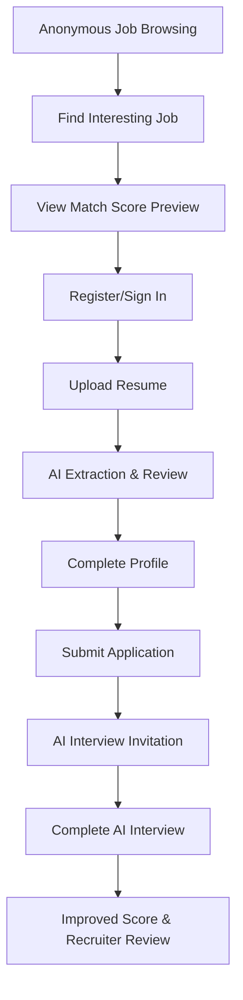
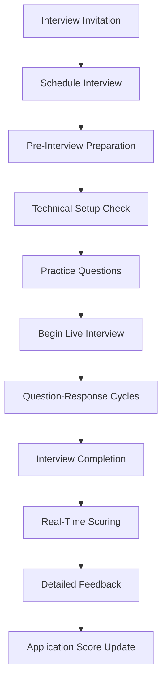
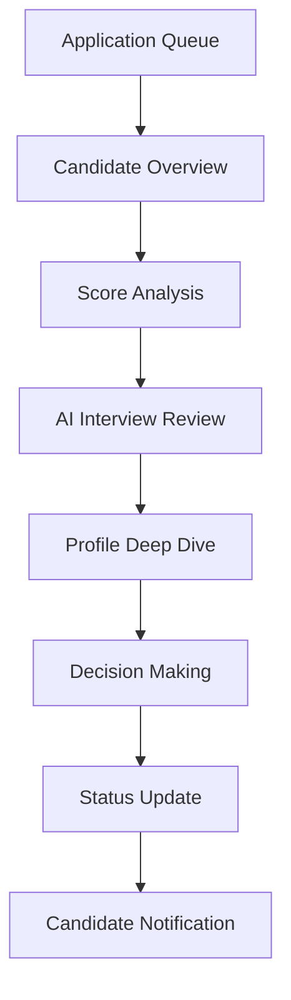

# TeamMatch AI-Powered Job Application System - UX Specification

## 🎨 Executive UX Summary

TeamMatch represents a paradigm shift in hiring technology, requiring UX design that builds trust through transparency while introducing revolutionary AI-powered interactions. The primary challenge is making sophisticated AI capabilities feel natural, professional, and empowering rather than intimidating or black-box.

**Key UX Principles:**

- **AI Transparency**: Every AI decision includes clear explanations and improvement pathways
- **Progressive Trust Building**: Candidates control their journey from anonymous browsing to AI interviews
- **Professional Authenticity**: D-ID avatars and voice interactions maintain hiring process gravitas
- **Empowerment Through Feedback**: Users gain actionable insights to improve their candidacy
- **Inclusive Design**: WCAG 2.1 AA compliance ensures accessibility for all users

---

## 👥 User Personas & Journey Analysis

### Primary Persona: **Technical Job Seeker - "Alex"**

- **Demographics:** 25-40 years old, 3-8 years experience, actively job searching
- **Pain Points:** Frustration with "black box" applications, lack of feedback, generic rejection emails
- **Goals:** Understand where they stand, improve candidacy, find the right role fit
- **Technology Comfort:** High - comfortable with AI tools and video interviews
- **Key Motivations:** Career growth, salary increase, better work-life balance

### Secondary Persona: **Hiring Manager - "Jordan"**

- **Demographics:** 30-50 years old, manages 5-15 person teams, hires 3-12 people per year
- **Pain Points:** Time spent on obviously mismatched candidates, bias in initial screening
- **Goals:** Find quality candidates efficiently, reduce time-to-hire, make objective decisions
- **Technology Comfort:** Medium - appreciates efficiency but needs intuitive interfaces
- **Key Motivations:** Team growth, hiring quality, process efficiency

### Tertiary Persona: **Recruiter - "Sam"**

- **Demographics:** 25-45 years old, processes 50-200 applications per role
- **Pain Points:** Manual resume screening, coordinating interviews, candidate communication
- **Goals:** Process applications efficiently, maintain candidate experience, demonstrate ROI
- **Technology Comfort:** Medium-High - power user of recruiting tools
- **Key Motivations:** Productivity, candidate satisfaction, measurable outcomes

---

## 🎯 Core UX Design Challenges & Solutions

### Challenge 1: AI Interview Trust & Comfort

**Problem:** Voice-based AI interviews with avatars could feel impersonal or intimidating
**Solution Framework:**

- **Preparation Rituals:** Clear pre-interview setup, technical checks, practice questions
- **Human-Like Interactions:** D-ID avatars with professional but warm demeanor
- **Control & Agency:** Pause, restart, and reschedule options throughout
- **Transparent Process:** Clear explanation of scoring methodology and use of results

### Challenge 2: Complex Score Transparency

**Problem:** Multi-factor scoring (semantic, skills, experience, location) could overwhelm users
**Solution Framework:**

- **Visual Hierarchy:** Primary score prominent, detailed breakdown on demand
- **Progressive Disclosure:** Summary → detailed breakdown → improvement suggestions
- **Contextual Explanations:** Tooltips and inline help for technical concepts
- **Action-Oriented Design:** Every score includes "how to improve" guidance

### Challenge 3: Multi-Platform Consistency

**Problem:** Complex workflows must work seamlessly across desktop and mobile
**Solution Framework:**

- **Desktop-First Design:** Complex interfaces optimized for larger screens
- **Mobile Progressive Enhancement:** Key features adapted for mobile consumption
- **Consistent Interaction Patterns:** Same gestures and navigation across devices
- **Context-Aware Adaptation:** Features prioritized based on device capabilities

---

## 🏗️ Information Architecture

### Site Structure

```
TeamMatch Platform
├── 🏠 Public Area (Anonymous)
│   ├── Job Listings (Browse/Search)
│   ├── Job Detail Pages
│   └── Authentication (Sign In/Up)
├── 👤 Candidate Portal (Authenticated)
│   ├── Dashboard (Application Overview)
│   ├── Profile Management
│   │   ├── Resume Upload & AI Extraction
│   │   ├── Profile Review & Editing
│   │   └── Skills & Experience Management
│   ├── Job Application System
│   │   ├── Application Form & Scoring
│   │   ├── AI Interview Scheduling
│   │   └── Application Status Tracking
│   ├── AI Interview Interface
│   │   ├── Pre-Interview Setup
│   │   ├── Live Interview Session
│   │   └── Results & Feedback
│   └── Account Settings
└── 🏢 Recruiter Portal (Authenticated)
    ├── Recruiter Dashboard
    ├── Job Management (CRUD)
    ├── Candidate Review System
    ├── Application Processing
    ├── Interview Recording Review
    └── Analytics & Reporting
```

### Navigation Principles

- **Context-Aware Menus:** Navigation adapts to user role and current workflow stage
- **Breadcrumb Clarity:** Always show user location within complex workflows
- **Quick Actions:** Floating action buttons for primary tasks in each section
- **Progressive Enhancement:** Advanced features revealed as users gain familiarity

---

## 🔄 Critical User Flows

### Flow 1: First-Time Candidate Journey



**UX Considerations:**

- **Friction Reduction:** Minimal required fields during registration
- **Value Preview:** Show match scores before requiring registration
- **Progress Indication:** Clear steps and completion percentages
- **AI Transparency:** Explain extraction results and accuracy

### Flow 2: AI Interview Experience



**UX Considerations:**

- **Anxiety Reduction:** Clear expectations and practice opportunities
- **Professional Atmosphere:** Maintain hiring process formality
- **Technical Reliability:** Robust error handling and backup options
- **Immediate Feedback:** Real-time progress and final results

### Flow 3: Recruiter Candidate Review



**UX Considerations:**

- **Efficiency Focus:** Batch actions and keyboard shortcuts
- **Decision Support:** AI insights and recommendation summaries
- **Collaboration Tools:** Team feedback and discussion threads
- **Audit Trail:** Complete history of decisions and rationale

---

## 🎨 Visual Design System

### Color Psychology & Accessibility

- **Primary Purple (#A16AE8):** Innovation, wisdom, AI capability
- **Secondary Blue (#8096FD):** Trust, reliability, professionalism
- **Success Green (#4CAF50):** Positive feedback, completed actions
- **Warning Amber (#FF9800):** Attention needed, improvement opportunities
- **Error Red (#F44336):** Critical issues, failures
- **Neutral Greys (#F5F5F5 to #212121):** Content hierarchy, backgrounds

**Accessibility Compliance:**

- All color combinations meet WCAG 2.1 AA standards (4.5:1 contrast minimum)
- Color never used as sole indicator of meaning
- High contrast mode support for vision impaired users

### Typography Hierarchy

- **Display Text:** Material-UI h2 for page titles and major sections
- **Headlines:** Material-UI h4 for card headers and key information
- **Body Text:** Material-UI body1 for main content, optimized for readability
- **Caption Text:** Material-UI caption for metadata and supplementary information
- **Code/Technical:** Monospace font for API responses and technical data

### Iconography Standards

- **Material Design Icons:** Consistent icon library throughout platform
- **Custom AI Icons:** Purpose-built icons for AI interview, scoring, and analysis features
- **Status Indicators:** Clear visual language for application states and progress
- **Interactive States:** Hover, active, disabled, and focus states clearly defined

---

## 📱 Responsive Design Framework

### Breakpoint Strategy

- **Mobile First:** 320px+ (iOS SE and Android minimum)
- **Tablet Portrait:** 768px+ (iPad and similar devices)
- **Desktop Small:** 1024px+ (laptop screens)
- **Desktop Large:** 1440px+ (desktop monitors)
- **Ultra-wide:** 1920px+ (large displays and dual monitor setups)

### Component Adaptation Patterns

#### Navigation Adaptation

- **Mobile:** Bottom tab navigation for primary sections
- **Tablet:** Side drawer navigation with persistent visibility option
- **Desktop:** Top horizontal navigation with dropdown menus

#### Data Display Adaptation

- **Mobile:** Card-based vertical stacking, swipe gestures
- **Tablet:** Mixed grid/list views with toggle options
- **Desktop:** Data tables with advanced filtering and sorting

#### Complex Workflows Adaptation

- **Mobile:** Wizard-style stepped workflows, one task per screen
- **Tablet:** Semi-modal overlays maintaining context
- **Desktop:** Full-screen workflows with multi-panel layouts

---

## 🎤 AI Interview Interface Detailed Specification

### Pre-Interview Experience

#### Setup & Preparation Screen

```
┌─────────────────────────────────────┐
│ 🎯 Prepare for Your AI Interview    │
├─────────────────────────────────────┤
│                                     │
│ ✅ Technical Check Complete         │
│    Microphone: Working              │
│    Internet: Stable (45 Mbps)      │
│    Browser: Compatible              │
│                                     │
│ 📋 Interview Overview               │
│    Duration: 15-20 minutes          │
│    Questions: 8-12 personalized     │
│    Format: Voice conversation       │
│                                     │
│ 🎓 Practice Questions Available     │
│    [Try Sample Questions]           │
│                                     │
│ [Ready to Begin] [Reschedule]       │
└─────────────────────────────────────┘
```

#### Technical Check Interface

- **Microphone Test:** Record/playback with visual audio levels
- **Internet Speed Test:** Real-time bandwidth verification
- **Browser Compatibility:** Automatic detection with upgrade prompts
- **Backup Options:** Phone interview fallback if technical issues arise

### Live Interview Interface

#### Main Interview Screen Layout

```
┌─────────────────────────────────────────────────────┐
│ TeamMatch AI Interview - Senior Frontend Developer  │
├─────────────────────────────────────────────────────┤
│                    │                                │
│   [D-ID Avatar]     │  Question 3 of 10            │
│   Professional     │  ⏱️ 18:32 remaining           │
│   Interviewer      │                               │
│   [Speaking...]    │  🎤 [Mute] 🔊 [Volume] ⚠️ [Help] │
│                    │                               │
│   ┌─────────────────────────────────────────────┐   │
│   │ "Can you explain the difference between     │   │
│   │ React's useEffect and useMemo hooks?"       │   │
│   └─────────────────────────────────────────────┘   │
│                    │                               │
│   Status: Listening for your response              │
│   [●] Recording    │  Progress: ████████░░ 80%     │
└─────────────────────────────────────────────────────┘
```

#### Visual Design Elements

- **D-ID Avatar Presentation:**
  - Professional business attire aligned with company branding
  - Subtle facial expressions and lip-sync for natural conversation
  - Eye contact maintenance to simulate real interview engagement
  - Consistent avatar across all interviews for brand familiarity

- **Audio Visual Indicators:**
  - **Listening State:** Gentle pulsing animation around avatar
  - **Processing State:** Subtle thinking animation with progress dots
  - **Speaking State:** Active lip movement and speaking indicator
  - **Waiting State:** Neutral professional expression

- **Question Display:**
  - **Current Question:** Prominently displayed in readable typography
  - **Question Progress:** Visual stepper showing interview advancement
  - **Time Management:** Countdown timer with color coding (green→yellow→red)
  - **Context Hints:** Subtle indicators for question difficulty and category

#### Accessibility Features

- **Real-time Transcription:** Live captions for candidate responses
- **Alternative Input:** Text-based fallback for voice-impaired candidates
- **Visual Indicators:** Screen reader compatible status announcements
- **Keyboard Navigation:** Full interview controllable via keyboard shortcuts

### Post-Interview Results Interface

#### Immediate Scoring Display

```
┌─────────────────────────────────────────────────────┐
│ 🎉 Interview Complete - Excellent Performance!      │
├─────────────────────────────────────────────────────┤
│                                                     │
│ Overall Score: 87/100 (+12 points to application)   │
│ ████████████████████████████████████████████████▓▓▓ │
│                                                     │
│ Technical Accuracy: 85/100 (60% weight)            │
│ ████████████████████████████████████████████▓▓▓▓▓▓▓ │
│                                                     │
│ Communication Clarity: 91/100 (40% weight)         │
│ ██████████████████████████████████████████████████▓ │
│                                                     │
│ 🏆 Top Strengths:                                   │
│   • Clear problem-solving approach                  │
│   • Strong React/JavaScript knowledge               │
│   • Excellent communication skills                  │
│                                                     │
│ 🎯 Improvement Opportunities:                       │
│   • Consider advanced state management patterns     │
│   • Explore performance optimization techniques     │
│                                                     │
│ [View Detailed Analysis] [Replay Interview]         │
│ [Continue to Application Status]                    │
└─────────────────────────────────────────────────────┘
```

---

## 📊 Dashboard & Application Tracking

### Candidate Dashboard Design

#### Main Dashboard Layout

```
┌─────────────────────────────────────────────────────────────┐
│ Welcome back, Alex! 👋                                     │
├─────────────────────────────────────────────────────────────┤
│                                                             │
│ 📈 Your Application Portfolio                               │
│ ┌─────────┐ ┌─────────┐ ┌─────────┐ ┌─────────┐           │
│ │   12    │ │    4    │ │    2    │ │    1    │           │
│ │ Applied │ │ In AI   │ │Interview│ │ Offers  │           │
│ │         │ │Interview│ │         │ │         │           │
│ └─────────┘ └─────────┘ └─────────┘ └─────────┘           │
│                                                             │
│ 🎯 Action Items (3)                                        │
│ • Complete AI interview for Frontend Role at TechCorp      │
│ • Update skills profile (2 new technologies detected)      │
│ • Schedule follow-up call with StartupXYZ                  │
│                                                             │
│ 📋 Recent Applications                                      │
│ ┌─────────────────────────────────────────────────────────┐ │
│ │ Senior React Developer | TechCorp          Score: 89    │ │
│ │ Applied 2 days ago • AI Interview Complete • ⏰ Pending │ │
│ │ [View Details] [Message Recruiter]                      │ │
│ ├─────────────────────────────────────────────────────────┤ │
│ │ Full-Stack Engineer | StartupXYZ           Score: 76    │ │
│ │ Applied 1 week ago • 📞 Phone screen scheduled          │ │
│ │ [Prepare for Interview] [View Details]                  │ │
│ └─────────────────────────────────────────────────────────┘ │
│                                                             │
│ 🔍 [Discover New Jobs] 📝 [Update Profile]                 │
└─────────────────────────────────────────────────────────────┘
```

#### Application Status Visualization

- **Progress Stepper:** Material-UI stepper component showing application phases
- **Score Trending:** Line charts showing score improvements over time
- **Status Badges:** Color-coded indicators for quick status recognition
- **Action-Oriented Design:** Every status includes clear next steps

### Score Transparency Interface

#### Detailed Score Breakdown

```
┌─────────────────────────────────────────────────────────────┐
│ Application Score Analysis: Senior React Developer          │
├─────────────────────────────────────────────────────────────┤
│                                                             │
│ Overall Match Score: 89/100                                 │
│ ████████████████████████████████████████████████████████▓   │
│                                                             │
│ 📊 Score Components:                                        │
│                                                             │
│ Semantic Match (40%): 92/100                               │
│ ████████████████████████████████████████████████████████▓▓  │
│ ✅ Strong alignment with job requirements                   │
│ ✅ Excellent technology stack overlap                       │
│                                                             │
│ Skills Alignment (35%): 88/100                             │
│ ██████████████████████████████████████████████████████▓▓▓   │
│ ✅ React (5 years) - Exceeds requirements (3+ years)       │
│ ✅ TypeScript (3 years) - Meets requirements               │
│ ⚠️ GraphQL (1 year) - Below preferred (2+ years)           │
│                                                             │
│ Experience Level (15%): 85/100                             │
│ ███████████████████████████████████████████████████▓▓▓▓▓    │
│ ✅ 5 years total - Matches requirements                     │
│ ⚠️ Limited senior role experience                           │
│                                                             │
│ Additional Factors (10%): 95/100                           │
│ █████████████████████████████████████████████████████████▓  │
│ ✅ Location match (San Francisco)                           │
│ ✅ Company size preference alignment                        │
│                                                             │
│ 🎯 Improvement Recommendations:                             │
│ • Add GraphQL projects to gain experience                   │
│ • Highlight leadership/mentoring experiences                │
│ • Consider senior-level certifications                      │
│                                                             │
│ [Update Profile] [View Similar Roles] [Schedule AI Interview]│
└─────────────────────────────────────────────────────────────┘
```

---

## 🏢 Recruiter Interface Specifications

### Recruiter Dashboard Design

#### Application Review Interface

```
┌─────────────────────────────────────────────────────────────┐
│ Candidate Pipeline: Frontend Developer Role                 │
├─────────────────────────────────────────────────────────────┤
│                                                             │
│ Filters: [All Stages ▼] [Score Range ▼] [Date ▼] [Sort ▼]  │
│                                                             │
│ ┌─────────────────────────────────────────────────────────┐ │
│ │ 👤 Sarah Chen                          Score: 91 (+8)    │ │
│ │ Senior React Developer • 6 years exp • San Francisco     │ │
│ │ Applied 2 days ago • AI Interview: 88/100 • 🎥 Available │ │
│ │                                                         │ │
│ │ 🎯 AI Insights: Strong technical skills, excellent       │ │
│ │ communication. Minor gaps in GraphQL experience.        │ │
│ │                                                         │ │
│ │ [👀 View Profile] [🎥 Watch Interview] [📧 Message]      │ │
│ │ [✅ Advance] [❌ Decline] [📝 Add Note]                 │ │
│ └─────────────────────────────────────────────────────────┘ │
│                                                             │
│ ┌─────────────────────────────────────────────────────────┐ │
│ │ 👤 Marcus Rodriguez                    Score: 76         │ │
│ │ Full-Stack Developer • 4 years exp • Remote             │ │
│ │ Applied 3 days ago • No AI Interview • Invited          │ │
│ │                                                         │ │
│ │ 🎯 AI Insights: Good technical foundation, consider      │ │
│ │ AI interview to assess communication skills.            │ │
│ │                                                         │ │
│ │ [👀 View Profile] [📧 Interview Invite] [📝 Add Note]   │ │
│ └─────────────────────────────────────────────────────────┘ │
│                                                             │
│ Showing 24 of 156 candidates                               │
│ [← Previous] [Page 1 of 7] [Next →]                        │
└─────────────────────────────────────────────────────────────┘
```

#### AI Interview Review Interface

- **Video Playback Controls:** Chapter markers for each question, playback speed control
- **Synchronized Transcripts:** Clickable transcript with timestamp navigation
- **Scoring Annotations:** Visual indicators showing AI scoring rationale
- **Comparison Tools:** Side-by-side interview comparisons for multiple candidates

### Analytics & Reporting Interface

#### Recruitment Analytics Dashboard

```
┌─────────────────────────────────────────────────────────────┐
│ Recruitment Performance Analytics                           │
├─────────────────────────────────────────────────────────────┤
│                                                             │
│ 📈 Key Metrics (Last 30 Days)                              │
│ ┌─────────────┐ ┌─────────────┐ ┌─────────────┐          │
│ │    18.5     │ │     156     │ │    89%      │          │
│ │ Avg Days    │ │ Applications│ │ Interview   │          │
│ │ to Hire     │ │ Received    │ │ Show Rate   │          │
│ └─────────────┘ └─────────────┘ └─────────────┘          │
│                                                             │
│ 📊 Application Quality Trends                               │
│ [Interactive Chart: Score Distribution Over Time]           │
│                                                             │
│ 🎯 AI Interview Impact                                      │
│ • 34% improvement in final hire quality scores             │
│ • 12% reduction in phone screen time                       │
│ • 91% candidate satisfaction with AI interview process     │
│                                                             │
│ 📋 Pipeline Health                                          │
│ [Funnel Chart: Application → Interview → Offer]            │
│                                                             │
│ [Export Data] [Schedule Report] [Share Dashboard]           │
└─────────────────────────────────────────────────────────────┘
```

---

## ♿ Accessibility & Inclusive Design

### WCAG 2.1 AA Compliance Framework

#### Visual Accessibility

- **Color Contrast:** All text meets 4.5:1 minimum ratio, enhanced text meets 7:1
- **Color Independence:** Information never conveyed through color alone
- **Typography:** Scalable fonts supporting up to 200% zoom without horizontal scrolling
- **Focus Indicators:** Clear, high-contrast focus rings on all interactive elements

#### Motor Accessibility

- **Keyboard Navigation:** Complete platform functionality available via keyboard
- **Touch Targets:** Minimum 44px touch targets on mobile interfaces
- **Gesture Alternatives:** All swipe/pinch gestures have button alternatives
- **Timeout Extensions:** User-controlled timeouts with warning notifications

#### Cognitive Accessibility

- **Clear Language:** Plain language principles, technical jargon explained
- **Consistent Navigation:** Predictable UI patterns and consistent terminology
- **Error Prevention:** Clear validation with helpful error messages
- **Progress Indicators:** Clear progress tracking through complex workflows

#### Auditory Accessibility

- **Transcript Support:** All AI interviews include real-time transcription
- **Visual Alternatives:** Audio cues have visual equivalents
- **Subtitle Options:** Video content includes accurate captions
- **Alternative Formats:** Text-based alternatives for voice-only interactions

### AI Interview Accessibility Accommodations

#### Alternative Interview Formats

- **Text-Based Interview:** Full keyboard interaction for voice-impaired candidates
- **Extended Time Options:** Additional time for candidates with processing needs
- **Screen Reader Compatibility:** Optimized for NVDA, JAWS, and VoiceOver
- **High Contrast Mode:** Enhanced visual contrast for vision-impaired users

---

## 📱 Mobile Experience Optimization

### Mobile-First Features

#### Optimized Job Browsing

- **Thumb-Friendly Navigation:** Bottom tab bar for primary actions
- **Swipe Gestures:** Swipe through job cards, pull-to-refresh
- **Offline Capabilities:** Cache recent jobs for offline viewing
- **Location Awareness:** GPS-based job recommendations

#### Mobile AI Interview Experience

- **Portrait Orientation Optimization:** Full-screen interview interface
- **Background App Prevention:** Lock screen during interviews to prevent interruptions
- **Mobile-Optimized Avatar:** Efficient video streaming for mobile bandwidth
- **Touch-Based Controls:** Large, easy-to-tap audio controls

#### Progressive Web App Features

- **Home Screen Installation:** Add to home screen capability
- **Push Notifications:** Application status updates and interview reminders
- **Background Sync:** Sync application data when connectivity restored
- **Offline Fallback:** Basic functionality available without internet

---

## 🎨 Material-UI Implementation Guidelines

### Component Library Standards

#### Custom Theme Configuration

```javascript
const teamMatchTheme = {
  palette: {
    primary: {
      main: '#A16AE8',
      light: '#D4B6F4',
      dark: '#7B4CBD',
    },
    secondary: {
      main: '#8096FD',
      light: '#B3C3FE',
      dark: '#5C7CFC',
    },
    success: {
      main: '#4CAF50',
    },
    warning: {
      main: '#FF9800',
    },
    error: {
      main: '#F44336',
    },
  },
  typography: {
    fontFamily: 'Roboto, Arial, sans-serif',
    h1: { fontSize: '2.5rem', fontWeight: 300 },
    h2: { fontSize: '2rem', fontWeight: 400 },
    h4: { fontSize: '1.5rem', fontWeight: 500 },
    body1: { fontSize: '1rem', lineHeight: 1.6 },
    caption: { fontSize: '0.875rem', color: 'text.secondary' },
  },
};
```

#### Custom Component Specifications

**ScoreDisplay Component:**

- Circular progress indicators for scores
- Color-coded based on score ranges (red/yellow/green)
- Animated transitions when scores update
- Accessible alternative text for screen readers

**ApplicationStatusChip Component:**

- Material-UI Chip with custom status colors
- Icons indicating status type (clock, checkmark, etc.)
- Hover tooltips with detailed status information
- Consistent sizing and spacing across interfaces

**InterviewControls Component:**

- Floating action button for primary actions
- Material-UI IconButton for secondary controls
- Visual feedback for audio levels and connection status
- Disabled states for unavailable actions

---

## 🚀 Implementation Priorities & Phasing

### Phase 1: Foundation (Epic 1)

**UX Priority Focus:**

- **Authentication Flow:** Streamlined registration with social login options
- **Job Browsing Interface:** Clean, fast job discovery with filtering
- **Responsive Framework:** Mobile-first responsive design system
- **Basic Profile Creation:** Simple profile setup with clear progress indication

### Phase 2: AI Intelligence (Epic 2)

**UX Priority Focus:**

- **Resume Upload Experience:** Drag-and-drop with clear processing feedback
- **AI Extraction Review:** Side-by-side editing interface with transparency
- **Score Transparency:** Clear, understandable score breakdowns with improvement paths
- **Profile Enhancement:** Rich profile editing with auto-save and version control

### Phase 3: AI Interviews (Epic 3)

**UX Priority Focus:**

- **Interview Preparation:** Comprehensive setup and practice experience
- **Live Interview Interface:** Professional, anxiety-reducing interview environment
- **Real-time Feedback:** Immediate scoring with detailed performance analysis
- **Results Integration:** Seamless application status updates and next steps

### Phase 4: Advanced Tools (Epic 4)

**UX Priority Focus:**

- **Recruiter Workflows:** Efficient batch processing and candidate review tools
- **Advanced Analytics:** Data visualization and reporting dashboards
- **Collaboration Tools:** Team-based hiring workflows and communication
- **Enterprise Features:** White-labeling and advanced integration capabilities

---

## 🎯 Success Metrics & UX KPIs

### User Experience Success Metrics

#### Candidate Experience KPIs

- **Registration Conversion:** >65% of job viewers register within session
- **Profile Completion:** >80% complete profile setup within 48 hours
- **AI Interview Participation:** >70% of eligible candidates complete AI interviews
- **Interview Satisfaction:** >90% rate AI interview experience positively
- **Score Understanding:** >85% understand their score breakdown without help

#### Recruiter Experience KPIs

- **Time to Review:** <2 minutes average per candidate review
- **Interview Video Usage:** >80% watch AI interview recordings
- **Decision Confidence:** >85% report increased hiring confidence
- **Platform Adoption:** >90% weekly active usage among paying recruiters
- **Feature Discovery:** >60% use advanced filtering and analytics features

#### Technical Performance KPIs

- **Page Load Speed:** <3 seconds for all critical pages
- **Mobile Experience:** >95% feature parity between desktop and mobile
- **Accessibility Score:** 100% WCAG 2.1 AA compliance across all interfaces
- **Error Rate:** <1% user-facing errors during critical workflows
- **AI Response Time:** <500ms for all AI-powered interactions

### Continuous Improvement Framework

#### User Research Integration

- **Monthly User Testing:** Regular usability testing with new features
- **Interview Analytics:** Analysis of AI interview completion patterns
- **Feedback Collection:** In-app feedback widgets and regular NPS surveys
- **A/B Testing:** Continuous optimization of critical conversion funnels

#### Design System Evolution

- **Component Library Updates:** Regular updates based on usage patterns
- **Accessibility Audits:** Quarterly accessibility compliance reviews
- **Performance Monitoring:** Real-user monitoring of interface performance
- **Cross-Platform Consistency:** Regular reviews ensuring device parity

---

This comprehensive UX specification provides the foundation for creating a world-class AI-powered hiring platform that builds trust through transparency, empowers users through feedback, and maintains professional standards while introducing revolutionary AI capabilities.

The design prioritizes user empowerment, making complex AI interactions feel natural and beneficial rather than intimidating. Every interface decision supports the core mission of transforming hiring through intelligent, transparent, and inclusive technology.

Ready for technical architecture review and development handoff! 🚀
